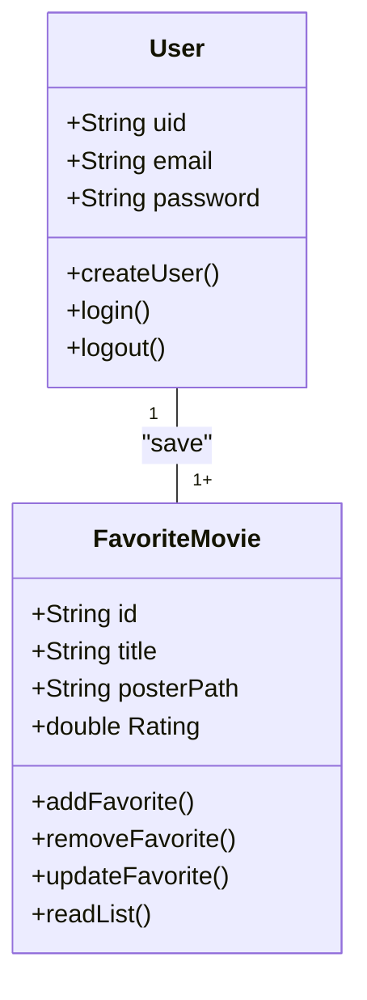
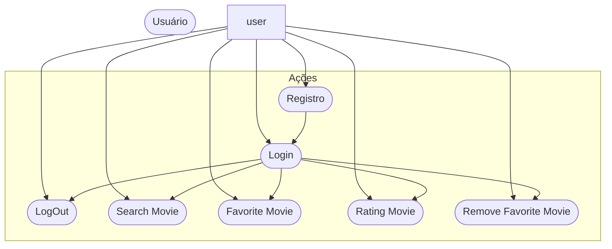
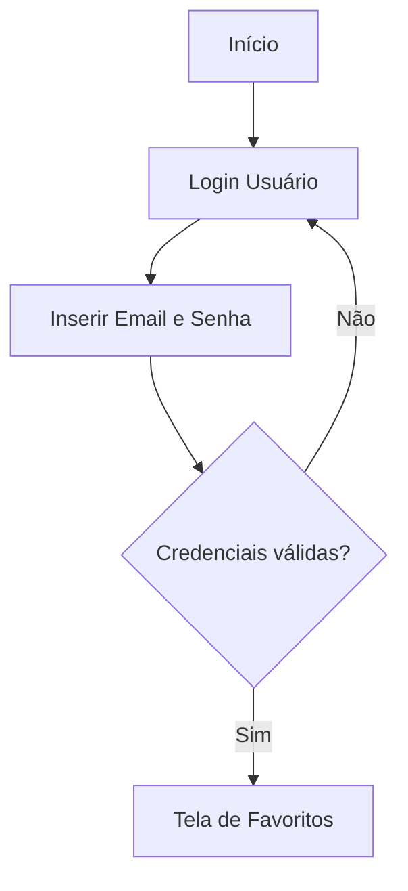

# CineFavorite - Formativa
Construir um Aplicativo do Zero - O CineFavorite permitirá criar uma conta e buscar filmes em uma API e montar uma galeria pessoal de filmes favoritos, com posters e notas

## Objetivos
- Criar uma galeria Personalizada por Usuario de filmes Favoritos
- Conectar com uma API (base de Dados) de filmes
- Permitir a Criação de contas para cada Usuário
- Listar Filmes por Palavra-Chave

## levantamento de Requistos do Projeto
- ### Funcionais 
    - Separar contas de usuário
    - Salvar filmes nos Favoritos

- ### não Funcionais

## Recursos do Projeto
- Flutter/Dart
- Firebase (Authentication/ FireStore Database)
- API TMDB
- Figma
- Vs Code
## Diagramas
- Demonstrar o Funcionamento das entidades do Sistema

1. ### Classes

- Usuario (User) : classe já modela pelo FirebaseAuth
        - email
        - password
        - UID
        - Login()
        - Create()
        - logout()

    - FilmeFavorito: Classe modelada pelo DEV
        - number:Id
        - String: Titulo
        - String Poster
        - double: Rating
        - adicionar()
        - remover()
        - listar()
        - updateNota()
        

2. ### Uso
    Ações que os Atores podem FAzer
    - User:
        - Registrar
        - Login
        - logout
        - Procurar Filmes API
        - SAlvar Filmes Favoritos
        - Dar Nota aos Filmes
        - Remover dos Favoritos

3. ### Fluxo
    Determina o caminho percorrido pelo autor para executar uma ação

    - Ação de Login

## Prototipagem

## Codificação